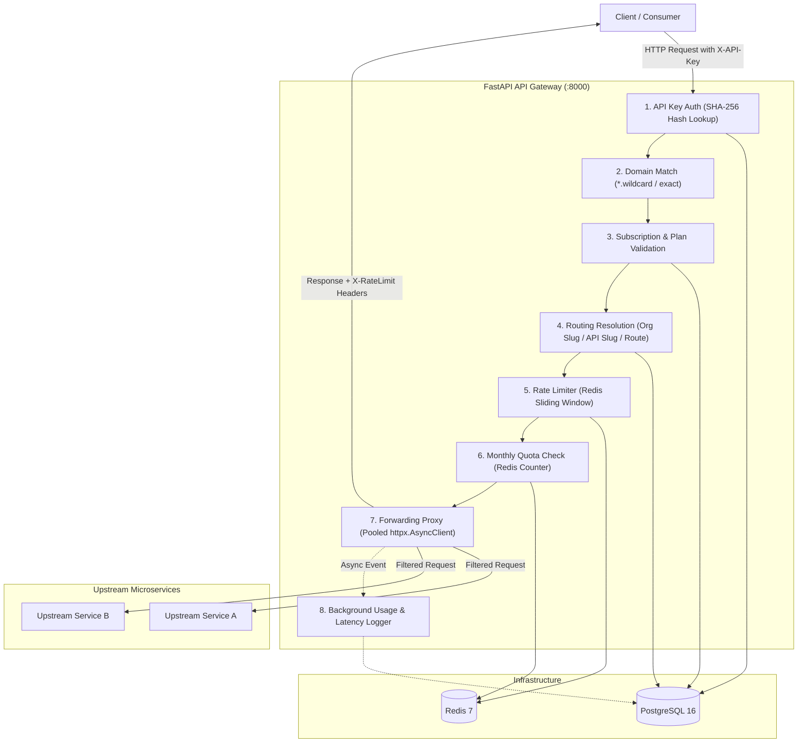

# ⚡ Multi-Tenant API Gateway & Platform

A high-performance, asynchronous **Multi-Tenant API Gateway & Developer Platform** built with **FastAPI**, **PostgreSQL (SQLAlchemy 2.0 Async)**, and **Redis**.

The gateway provides secure tenant isolation, organization-scoped RBAC, OAuth2/JWT authentication, API and route management, monetization plans, domain-restricted API keys, sliding window rate limiting, monthly quotas, transparent request forwarding, and real-time usage analytics.

---

## 🏗️ Architecture Overview



---

## ✨ Key Features

- **Multi-Tenant Isolation**: Organizations partition all resources (APIs, routes, plans, subscriptions, upstreams, and API keys).
- **Contextual RBAC**: Role-based access control (`owner`, `admin`, `member`) enforced per organization context.
- **Cryptographic API Key Lifecycle**:
  - Secure generation (`ak_live_...`) with SHA-256 hash storage.
  - Granular key prefixes for dashboard identification without exposing secrets.
  - Zero-downtime key regeneration and instant revocation.
- **Domain & CORS Restrictions**: Restrict API key execution to specific origin hostnames and wildcard domains (e.g. `*.example.com`).
- **Sliding-Window Rate Limiting**: Redis-backed rate limiting per API key / plan tier with `X-RateLimit-*` response headers.
- **Monthly Quota Enforcement**: Atomic monthly consumption counters in Redis with automatic rollover calculation.
- **Transparent Reverse Proxy**:
  - Non-blocking `httpx.AsyncClient` request forwarding.
  - Hop-by-hop header stripping (`Connection`, `Transfer-Encoding`, `Content-Length`).
  - Standardized gateway error translation (502 Bad Gateway, 504 Gateway Timeout, 429 Too Many Requests).
- **Asynchronous Analytics & Health Probing**:
  - Background recording of request latencies, status codes, and timestamps.
  - Organization- and API-level usage aggregation endpoints.
  - Automated upstream health probe service.

---

## 🛠️ Technology Stack

| Component | Technology | Rationale |
|---|---|---|
| **Framework** | [FastAPI](https://fastapi.tiangolo.com/) (Python 3.12) | High-throughput asynchronous ASGI, automatic OpenAPI/Swagger docs, type validation via Pydantic v2. |
| **Database** | [PostgreSQL 16](https://www.postgresql.org/) + [SQLAlchemy 2.0 Async](https://docs.sqlalchemy.org/) | ACID compliance, UUID keys, cascading foreign keys, async query execution via `asyncpg`. |
| **Migrations** | [Alembic](https://alembic.sqlalchemy.org/) | Version-controlled declarative database schema evolutions. |
| **Caching & Counters** | [Redis 7](https://redis.io/) (`redis.asyncio`) | Sub-millisecond atomic increments (`INCR`, `EXPIRE`) for rate limiting and monthly quota tracking. |
| **HTTP Client** | [HTTPX](https://www.python-httpx.org/) | Asynchronous connection-pooled HTTP client for reverse proxying and upstream health checks. |
| **Authentication** | [Passlib](https://passlib.readthedocs.io/) (Bcrypt) + [Python-Jose](https://python-jose.readthedocs.io/) | Cryptographic password hashing and JWT access/refresh token lifecycle. |
| **Containerization** | [Docker](https://www.docker.com/) & [Docker Compose](https://docs.docker.com/compose/) | Multi-stage slim builds, non-root security container, one-command local/staging deployment. |

---

## 📂 Project Structure

```
.
├── alembic/                 # Database schema migrations
│   └── versions/            # Migration scripts (tables, roles, schema)
├── app/
│   ├── api/
│   │   └── routes/          # REST API endpoints
│   │       ├── auth.py              # Login, register, JWT refresh, OAuth
│   │       ├── organizations.py     # Organization CRUD & deactivation
│   │       ├── organization_members.py # Member invites & role assignments
│   │       ├── upstreams.py         # Upstream targets management
│   │       ├── apis.py              # API catalog management
│   │       ├── api_routes.py        # Path & method route mappings
│   │       ├── api_plans.py         # Rate limit & quota pricing tiers
│   │       ├── subscriptions.py     # Consumer plan subscriptions
│   │       ├── api_keys.py          # API key generation & revocation
│   │       ├── api_key_domains.py   # Origin domain restrictions
│   │       ├── analytics.py         # Request metrics & latency summaries
│   │       ├── gateway.py           # Core gateway proxy & verification
│   │       └── health.py            # Gateway health check probe
│   ├── core/                # Global configuration, database & redis clients
│   ├── dependencies/        # FastAPI Depends injection (auth, rbac, services)
│   ├── models/              # SQLAlchemy 2.0 Declarative ORM models
│   ├── repositories/        # Clean database query layer
│   ├── schemas/             # Pydantic v2 validation & response models
│   ├── services/            # Core business logic (routing, proxy, rate limiting)
│   └── main.py              # Application entrypoint & lifespan lifecycle
├── tests/                   # Pytest async test suite
├── docker-compose.yml       # Full stack container configuration
├── Dockerfile               # Multi-stage production container build
├── requirements.txt         # Production dependencies
└── README.md
```

---

## 🚀 Getting Started

### Prerequisites
- Python 3.10+ (or Docker & Docker Compose)
- PostgreSQL 14+
- Redis 6+

### 1. Clone & Environment Setup
```bash
git clone https://github.com/Aryaman006/zari-backend.git
cd API-gateway

cp .env.example .env
```

### 2. Run with Docker Compose (Recommended)
```bash
docker-compose up --build -d
```
The API Gateway is now live at `http://localhost:8000`.

### 3. Local Development Setup

1. **Create and activate a virtual environment**:
   ```bash
   python -m venv .venv
   source .venv/bin/activate  # On Windows: .venv\Scripts\activate
   ```

2. **Install dependencies**:
   ```bash
   pip install -r requirements.txt
   ```

3. **Run database migrations**:
   ```bash
   alembic upgrade head
   ```

4. **Start the development server**:
   ```bash
   uvicorn app.main:app --reload --port 8000
   ```

---

## 📖 API Documentation

Interactive API documentation is automatically available when running the application:
- **Swagger UI**: [http://localhost:8000/docs](http://localhost:8000/docs)
- **ReDoc**: [http://localhost:8000/redoc](http://localhost:8000/redoc)
- **Health Check**: [http://localhost:8000/health/](http://localhost:8000/health/)

---

## 🧪 Testing

Run the automated asynchronous test suite:
```bash
pytest -v
```

The test suite validates:
- User registration, password hashing, and JWT token rotation.
- Organization-scoped multi-tenancy and contextual RBAC boundaries.
- Cross-tenant data isolation and injection protection.
- API key generation, prefix extraction, regeneration, and revocation.
- Domain restriction rules (exact domain and wildcard subdomains).
- Subscription lifecycle and plan validation.
- Redis sliding-window rate limiting and quota exhaustion.
- Real-time analytics aggregation.

---

## 🔒 Security Architecture

1. **Zero Raw Key Storage**: Raw API keys (`ak_live_...`) are returned only once upon creation/regeneration. Only SHA-256 hashes are persisted in the database.
2. **Contextual Tenant Scoping**: Every write, read, and routing operation validates that resources belong to the requesting tenant organization before database queries execute.
3. **Hop-by-Hop Header Sanitization**: Strips transport-level headers (`Connection`, `Transfer-Encoding`, `Content-Length`, `X-API-Key`) prior to upstream dispatch to prevent proxy manipulation attacks.
4. **Least-Privilege RBAC**: Granular permissions distinguish `owner` (billing & membership changes), `admin` (API & route configuration), and `member` (read access).

---

## 💬 Engineering Talking Points & Interview Guide

### 1. Why FastAPI and SQLAlchemy 2.0 Async?
> *FastAPI handles asynchronous I/O natively with ASGI. In an API gateway, the dominant bottleneck is network I/O waiting on upstreams, databases, and Redis. Async SQLAlchemy 2.0 using `asyncpg` prevents thread pool starvation under high concurrency, allowing a single lightweight container to process thousands of requests concurrently.*

### 2. How is Rate Limiting and Quota Enforcement Designed?
> *Rate limiting uses Redis atomic increment operations (`INCR`) with per-minute window expirations (`EXPIRE`), ensuring sub-millisecond overhead on every proxied request. Quotas track monthly aggregated usage with atomic counters reset on the first of each calendar month. Breaches immediately return HTTP 429 without hitting upstream services.*

### 3. How is Multi-Tenancy Enforced?
> *Tenancy is enforced contextually at both the dependency injection layer (FastAPI dependencies validating memberships and roles) and the database query layer (composite unique constraints on `(organization_id, slug)` and explicit tenant filters on all queries).*

---

## 📄 License
This project is open source and available under the [MIT License](LICENSE).
